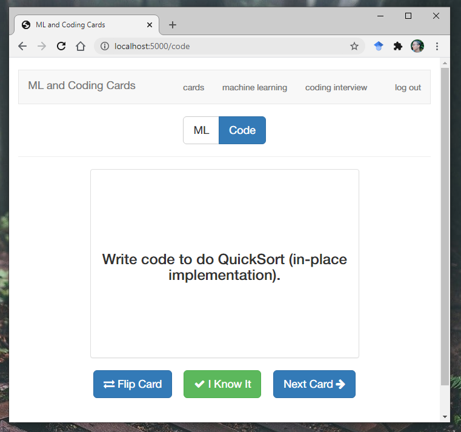

# Machine Learning and Coding Interview Cards

This is a fork of [this repo](https://github.com/jwasham/computer-science-flash-cards) by [@jwasham](https://github.com/jwasham) with my own database of cards. This is the set of cards I've been adding while learning/training for machine learning and coding interviews.

My database of cards has two categories (still under construction):  

- Machine Learning
    - Fundamentals
    - Algorithms
    - Theory
- Coding
    - Coding questions
    - python questions
    - Data structures
    - Time complexity analysis
    - Algorithms

Example front of card:



## How to convert to Anki or CSV

If you don't want to run a server, you can simply use Anki or a similar service/app. Use this script to convert from my sets (SQLite .db file), or yours, to CSV:

https://github.com/eyedol/tools/blob/master/anki_data_builder.py

Thanks [@eyedol](https://github.com/eyedol)

## How to run it on local host (Quick Guide)

*Provided by [@devyash](https://github.com/devyash) - devyashsanghai@gmail.com - Reach out to this contributor if you have trouble.*

1. Install dependencies:
  1. Install [Python ](https://www.python.org/download/releases/2.7/)
  2. Add python as environment variable [windows](http://stackoverflow.com/questions/3701646/how-to-add-to-the-pythonpath-in-windows-7)
  3. To install pip, securely download [get-pip.py](https://bootstrap.pypa.io/get-pip.py)
  4. Run ```python get-pip.py```in terminal
  5. Add pip to your PATH system variable [windows](https://stackoverflow.com/questions/23708898/pip-is-not-recognized-as-an-internal-or-external-command)
  6. Run ``` pip install -r requirements.txt``` in terminal after going to correct folder
2. Open flash_cards.py and uncomment the line 52-55 beginning from ``` @app.route('/initdb')```
3. Type ```python flash_cards.py``` - if you get error for flask then use ```python -m pip install Flask``` first then run ```flash_card.py``` file 
4. Open localhost:5000/initdb
5. Login using id:USERNAME='admin', PASSWORD='default. 
6. Comment the line 52-55 in flash_cards.py

NOTE: If you wish to use John's flash cards then also do following steps:
1. Copy db files such as ```cards-jwasham-extreme``` OR ```cards-jwasham``` and paste them in db folder
2. Edit file ```flash_cards.py``` line 11 and replace cards with any of the other database files
3. Repeat the above steps from step 3
Every time you wish to run your db just open folder in terminal and run  ```python flash_cards.py```